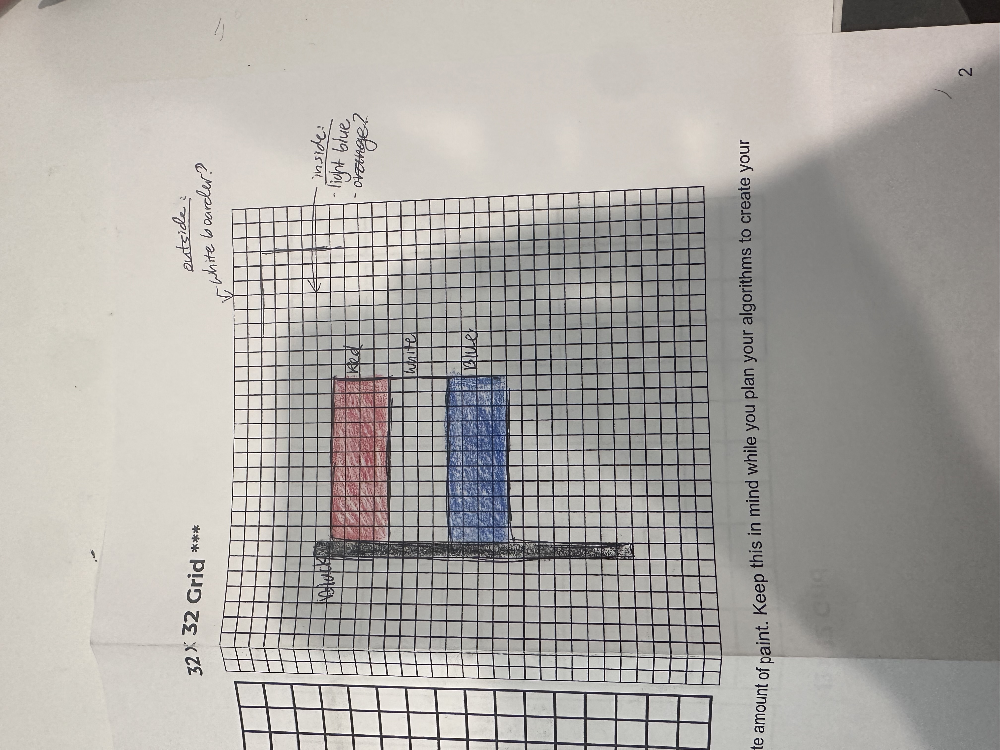

# asphalt-art-project
My project for Unit 1 APCSA.
# Unit 1 - Asphalt Art

## Introduction

Cities use asphalt art to improve public safety, inspire their residents and visitors, and brighten communities. Your goal is to create asphalt art to revitalize The Neighborhood and bring the community together with the help of the Painter.

## Requirements

Use your knowledge of object-oriented programming, algorithms, the problem solving process, and decomposition strategies to create asphalt art:
- **Create a new subclass** – Create at least one new subclass of the PainterPlus class that is used for a component of the asphalt art design.
- **Plan an algorithm** – Use the problem solving process and decomposition strategies to plan an algorithm that incorporates a combination of sequencing, selection, and/or iteration.
- **Write a method** – Write at least one method in a PainterPlus subclass that contributes to a component of the asphalt art design.
- **Document your code** – Use comments to explain the purpose of the methods and code segments.

## Notes: Neighborhood & Painter Class

This project was created on Code.org's JavaLab platform using the built in Neightborhood GUI output. To test and edit this project you must build in Code.org's JavaLab with the Neighborhood GUI enabled. For reference to the Painter class documentation, [you can read more here.](https://studio.code.org/docs/ide/javalab/classes/Painter)

## Output:

## Reflection

1. Describe your project.

   - My project replicates the Netherlands flag, as it represents the 3 identical colors and order the flag is. Using the colors red, white, and blue, the painter successfully paints a picture of the flag with a white border and light blue background. 

2. What are two things about your project that you are proud of?

   - One thing I'm proud of about this project is how identically it looks like the actualy Netherland flag. Additionally, although it was a little more work and time, working on the 32x32 grid was accomplishing and it provides more visual details.

3. Describe something you would improve or do differently if you had an opportunity to change something about your project.

   - Something that I would have done differently was to use less code in order to get around the grid to a specific part. For example, as I programmed the white border, I kept passing vacant grids that I would get back to later, which instead I could've just programmed the lines in a pattern.